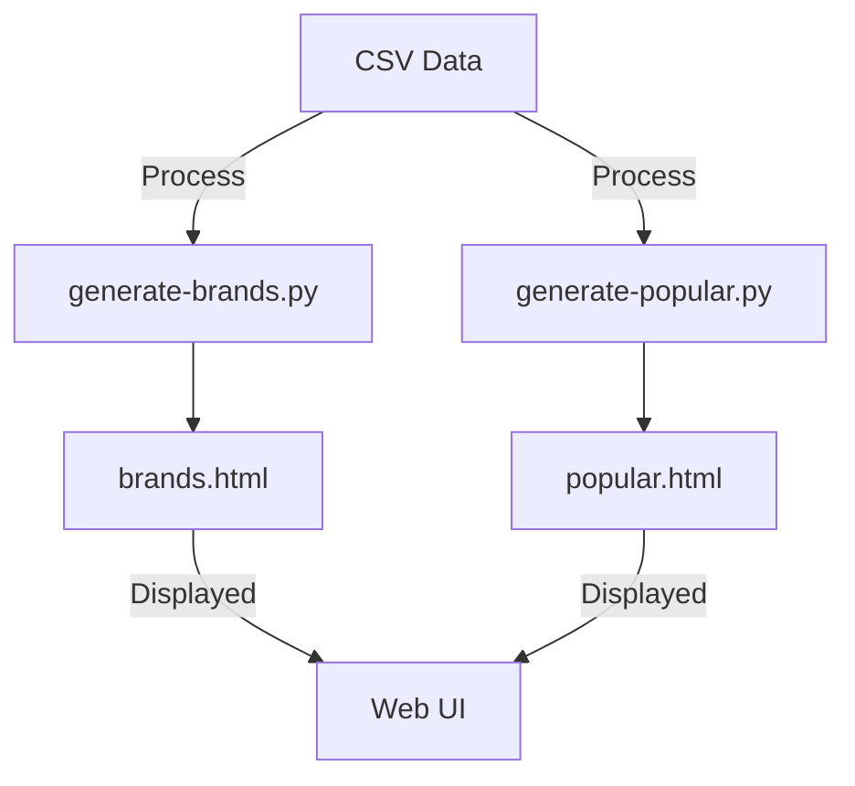

<h1 align="center">🚀 <a href="https://github.com/ronknight/static-brand-generator">Static Brand Generator</a></h1>

<h4 align="center">🔧 A Python-powered static site generator that organizes brand data and presents it in a structured HTML format.</h4>

<p align="center">
  <a href="https://twitter.com/PinoyITSolution"></a>
  <a href="https://github.com/ronknight?tab=followers"></a>
  <a href="https://github.com/ronknight/static-brand-generator/stargazers"></a>
  <a href="https://github.com/ronknight/static-brand-generator/network/members"></a>
  <a href="https://youtube.com/@PinoyITSolution"></a>
  <a href="https://github.com/ronknight/static-brand-generator/issues"></a>
  <a href="https://github.com/ronknight/static-brand-generator/blob/main/LICENSE"></a>
  <a href="https://github.com/ronknight"></a>
</p>

## 📌 Overview
The **Static Brand Generator** is a script-driven static site generator that creates a brand listing page using data from a CSV file. It categorizes brands alphabetically and by popularity, generating corresponding HTML files for easy browsing.

## 📂 Project Structure
```
static-brand-generator/
├── base.html                 # Base template for the static site
├── brands.html               # Alphabetical list of brands
├── generate-brands.py        # Script to generate brands.html from CSV
├── generate-popular.py       # Script to generate popular.html from CSV
├── brand-url-popular-rating.csv  # Data source with brand names, URLs, and popularity ratings
├── popular.html              # Page with the most popular brands
├── inventorylist.xls         # Additional inventory data (not directly used in HTML generation)
```

## 📊 CSV Data Structure
The `brand-url-popular-rating.csv` file contains the following columns:

| Column Name      | Description |
|-----------------|-------------|
| BrandName       | The name of the brand |
| URL            | The brand's URL |
| Popular-Rating | Popularity rating as an integer |
| Inv            | Availability status (TRUE/FALSE) |
| LogoName       | Name of the logo file (if available) |

## 🚀 Features
- 📌 **Alphabetical Listing**: Brands are categorized under respective starting letters.
- ⭐ **Popular Brands Section**: Brands sorted by popularity with logo integration.
- ⚡ **Static HTML Generation**: Creates `brands.html` and `popular.html` automatically.
- 🛠️ **Easy Customization**: Modify the base template (`base.html`) for a custom look.

## 🔧 Installation
1. Clone the repository:
   ```sh
   git clone https://github.com/ronknight/static-brand-generator.git
   cd static-brand-generator
   ```
2. Ensure Python is installed (>= 3.6).
3. Install dependencies (if required):
   ```sh
   pip install -r requirements.txt
   ```
4. Run the scripts to generate the static pages:
   ```sh
   python generate-brands.py
   python generate-popular.py
   ```

## 📌 Usage
1. Update the `brand-url-popular-rating.csv` file with new brand data.
2. Run the Python scripts to regenerate `brands.html` and `popular.html`.
3. Open the generated HTML files in a web browser.

## 📊 Visualization


## ⚠️ Disclaimer
This project processes publicly available brand data. Ensure compliance with any applicable data usage regulations before deploying it.

## 📜 License
This project is licensed under the MIT License - see the [LICENSE](https://github.com/ronknight/static-brand-generator/blob/main/LICENSE) file for details.

---
<h4 align="center">💡 Made with ❤️ by <a href="https://github.com/ronknight">Ron Knight</a></h4>

